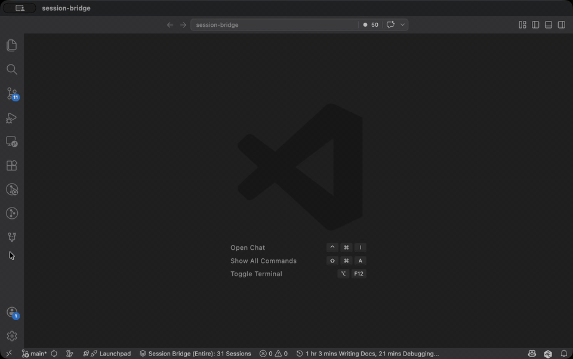
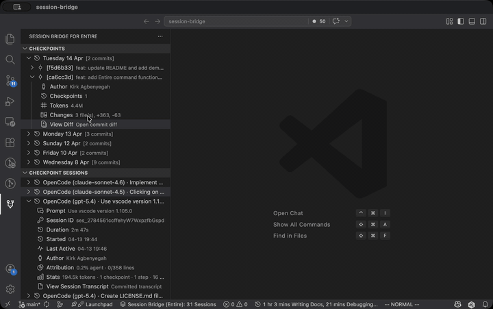
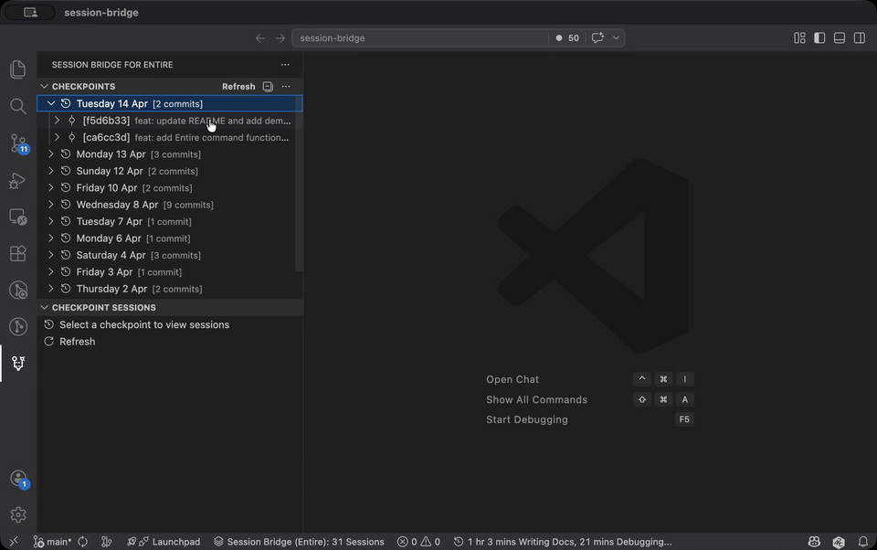
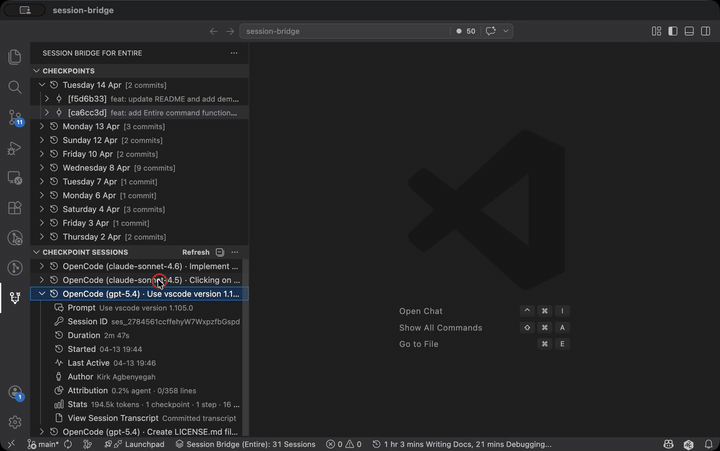
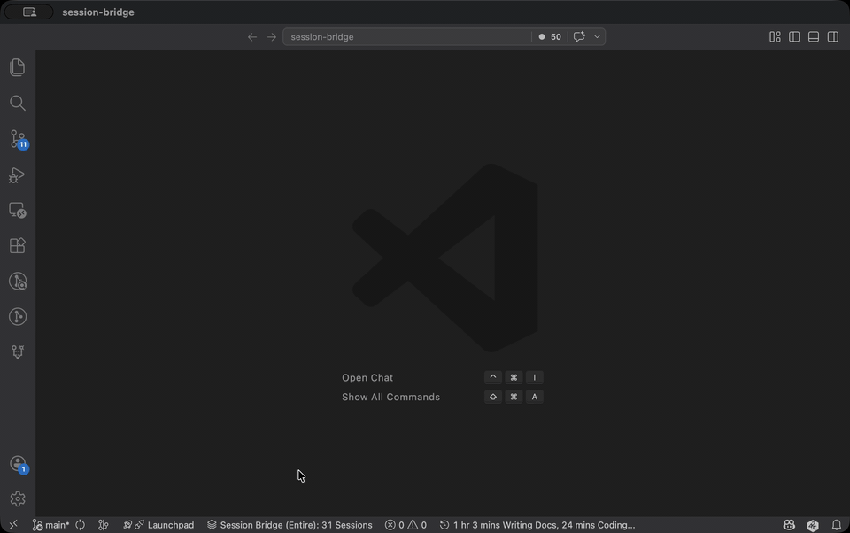

# Session Bridge

> This is an **unofficial** VS Code extension. It is not developed by, endorsed by, or in any way related to the [Entire](https://entire.io) team.

Session Bridge is an unofficial VS Code extension for browsing [Entire](https://entire.io) checkpoints and the committed sessions captured in those checkpoints from the current repository.

## Requirements
- Visual Studio Code `1.10` or newer (or editors compatible with VS Code `1.10+` APIs)
- [Entire CLI](github.com/entireio/cli) version `0.5.5` or newer

## Using the extension
Session Bridge works with any git repository that has [Entire](https://docs.entire.io/introduction) configured to capture your AI agent sessions. You don't need to be logged in to your [Entire](https://entire.io) account to view your sessions. 

Open any Entire managed git repository and the `Session Bridge (Entire)` status bar will show at the bottom. 

Select or open the installed Session Bridge extension to view your checkpoints.

## Features

- **Browse your committed checkpoints.**
  

- **View diffs of changes within a checkpoint.**
  

- **View sessions within a selected checkpoint.**
  

- **View details of a session.**
  

- **View status of active sessions.**
  

- **Run [Entire CLI](github.com/entireio/cli) commands**

## Known Issues

 - Some of the transcript might not be properly parsed.

## Release Notes

### 0.0.1

Initial release

## Contributing

Contributions are welcome! Please see our [Contribution Guide](CONTRIBUTING.md) for details on how to get started, coding standards, and our development workflow.